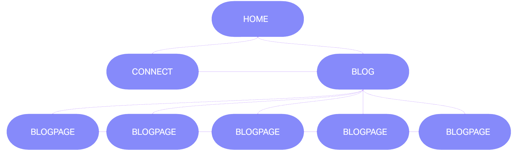
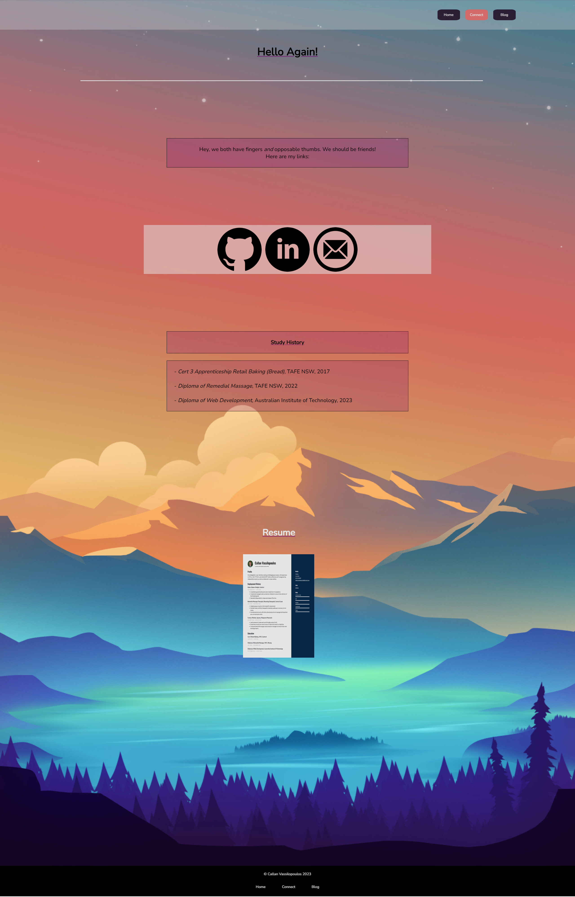
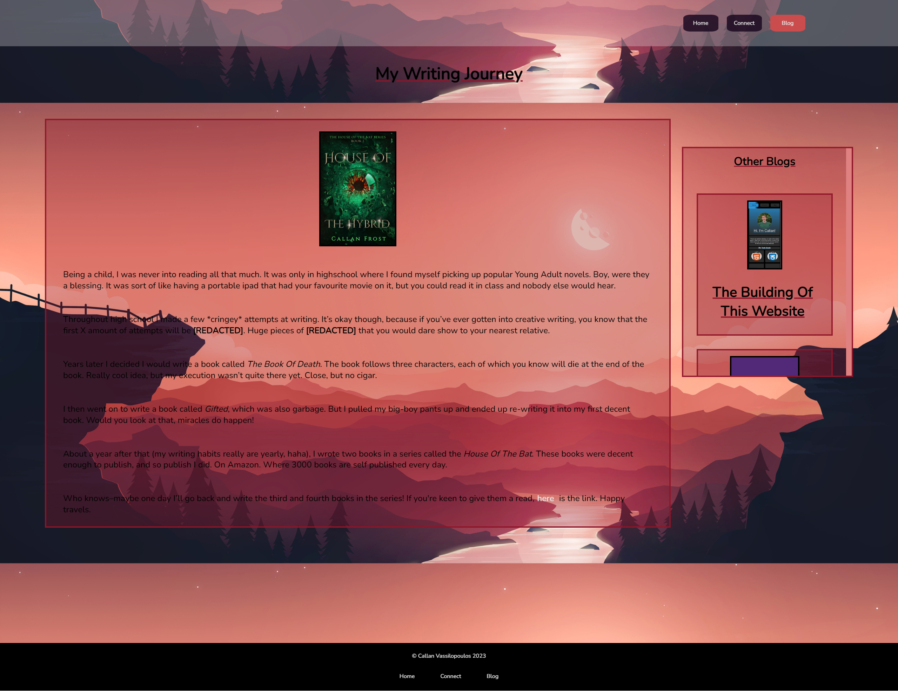
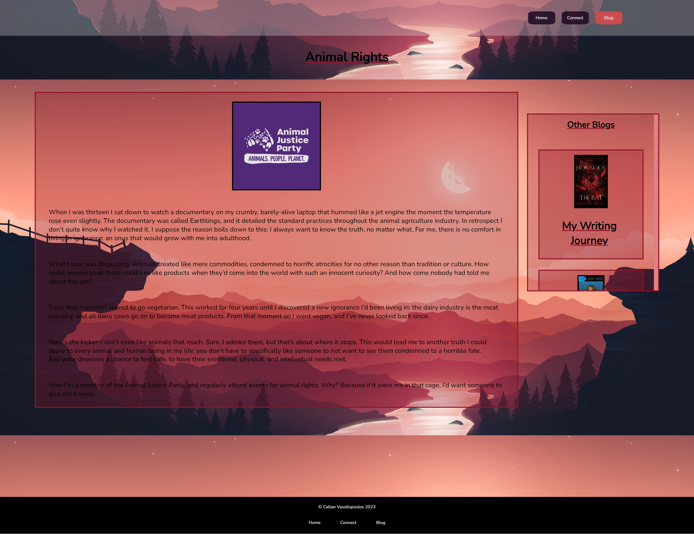
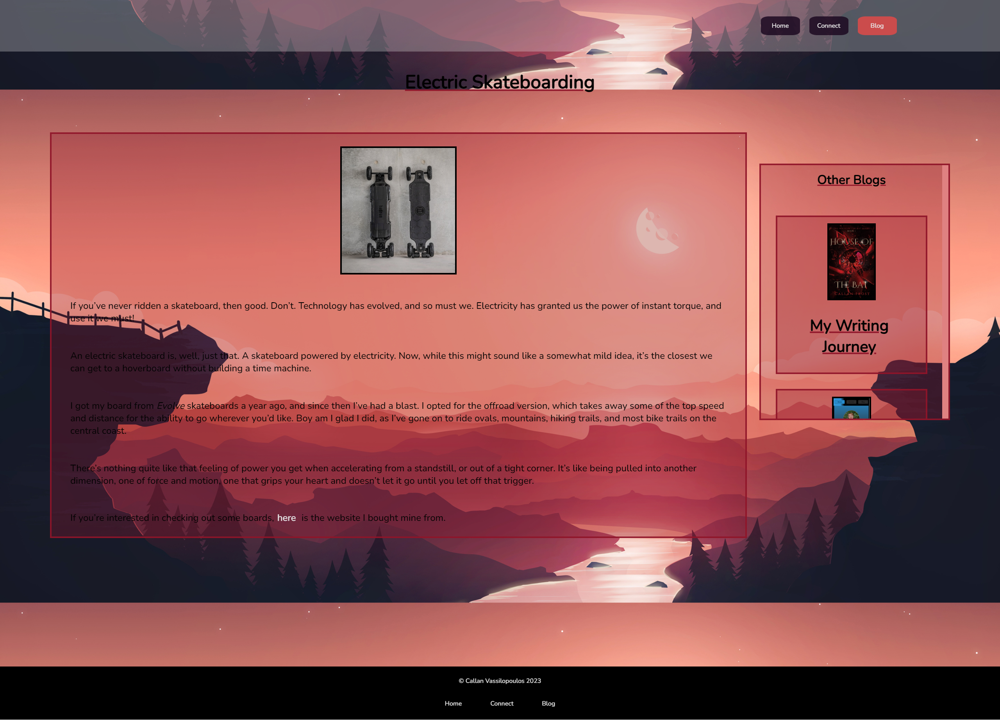
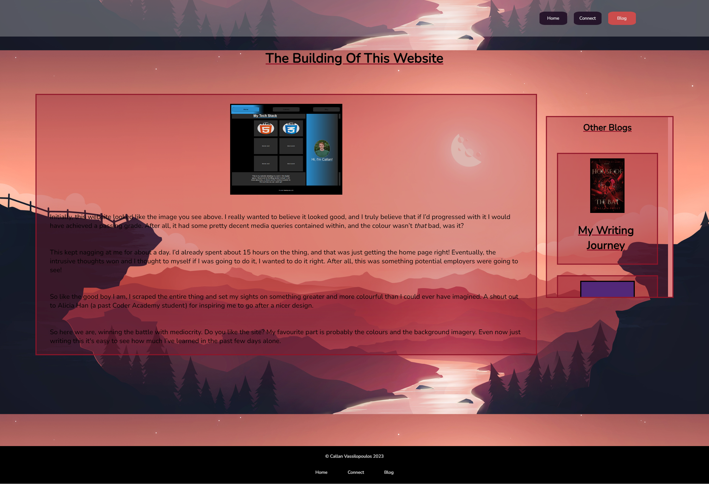
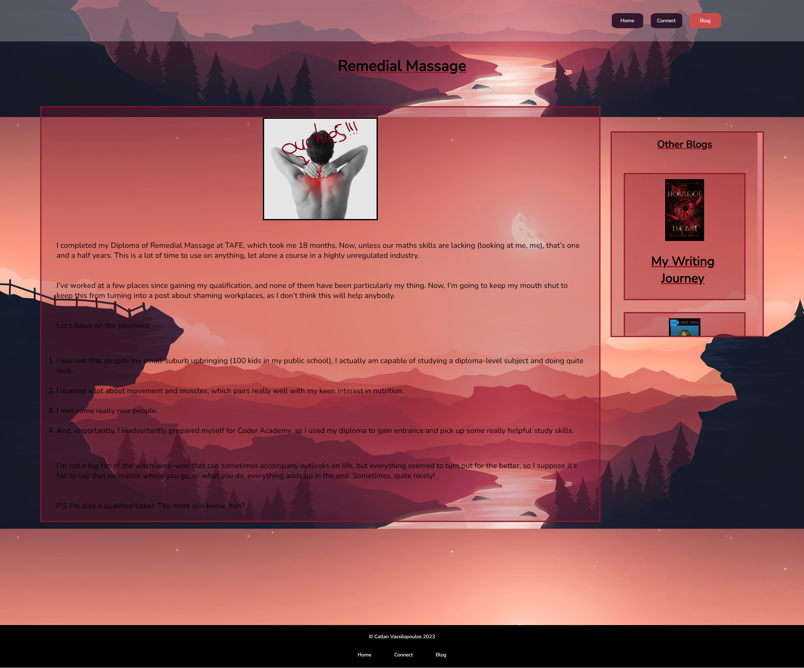

# Portfolio-Website-New

[Website Link](https://portfolio-website-new-gilt.vercel.app/)

[Github Repo Link](https://github.com/CallanVass/Portfolio-Website-New)

[Presentation Link]()

## Description

#### Purpose

The purpose of my website to create a professional space that potential employers might visit to gain a speedy insight into my tech stack and provide an easy way for them to contact me if they so wish. It also gives me a place to store my projects, and, in a way, to provide me with a certain level of introspection. Oh, and to pass my assignment!

### Functionality / Features

##### NAVBAR

Since every page has a navbar and footer, let's explore these first to keep this README DRY. 

The navbar sticks to the top of the screen no matter what. Upon adjustment from mobile to desktop, it goes from being centered to taking on the property of flex: flex-end, which sends it to the right side of the page.

The buttons are animated so that when hovered over they turn the pink colour of the currently navigated page, indicating to the user where they will go. This obviously changes depending on which page your on, so the user always sure where they are.

The transparent white background of the navbar container itself allows for the background image to take presedent of the visuals.

##### FOOTER 

The footer is comprised of two divs, one containing the copyright statement, and the other giving another miniature navbar of sorts. The text on the bottom div is spaced evenly with the three site navigation words. Home, Connect, and Blog. This allows for ease of access regardless of where your cursor is on the page.

The text of the second div is also animated to be pink when hovered over (originally white).

Both divs are coloured to black and stretch 100% of the viewport width. 

##### PAGES:

The site features 4 main types of pages, each with an independent background image. These are:

##### Home

The home section serves as a landing page for the site. Like all the other pages, it is colourful. However, the colours used in the home section are a very transparent orange, which suits the image behind. The features of the section are:

- An inspirational quote up the top (in case motivation runs low). This quote actually changes depending on mobile/tablet view-widths. It's achieved by having both quotes on the one HTML and setting the DISPLAY value to HIDDEN once a certain min-width is reached
- Responsive tech stack blocks that change from one column to two for mobile and desktop respectively

This page, like all the others, is designed to be responsive and therefore operates at whichever viewport size necessary. Like the other pages, it was also designed with the "mobile first" mindset, and then built upwards from there.

#### Connect

The connect page serves as a medium for communicating with potential employers or teachers. It's key features are:

- A div with linked icons to my Github, LinkedIn, and email address. Each one is sleek, black, and see-through in some way. Since the formatting for them is already completed, I can add or subtract the icons relatively easily
- A section with my study history
- A resume heading along with a small image of said resume. Either can be clicked and lead to a pdf of my resume
- A responsive line break between the heading and the first paragraph

#### Blog

The blog section of the websiten naturally, contains all the personality. It's features are:

- An introductory paragraph informing the user of the blogs below
- A responsive line break to divide the introduction and the blog post divs
- The blogs themselves, which are centered and each feature a related picture, paragraph, and publish date They also respong to being hovered over, which increases the opacity, indicating the div is hyperlinked to the user

#### Blogpage 

Each blog has its own individual page and content. The features are:

- A main div, which includes the primary content of the page. Inside the div is a picture on the topic of the subject and the text for the blog
-An aside which, depending on your mobile/desktop view, will either be below the main paragraph or to the right of it. It's a scrollable div which features the other blogposts, leading to easy navigation through the blogpages themselves

### Sitemap

### Screenshots

**Please note that some screenshots show repitions of the background image in the page. This is due to image sizing. The site does not look like this.**

**HOME:**

**CONNECT:**

**BLOG:**

**WRITING BLOG:**

**ANIMALS BLOG:**

**SKATEBOARDING BLOG:**

**WEBSITE BLOG:**

**MASSAGE BLOG:**

### Target Audience

Potential employers, teachers, possibly other students. People well-versed in tech.

#### Tech Stack:

- HTML for markup 
- CSS for stylesheets
- Vercel for deployment